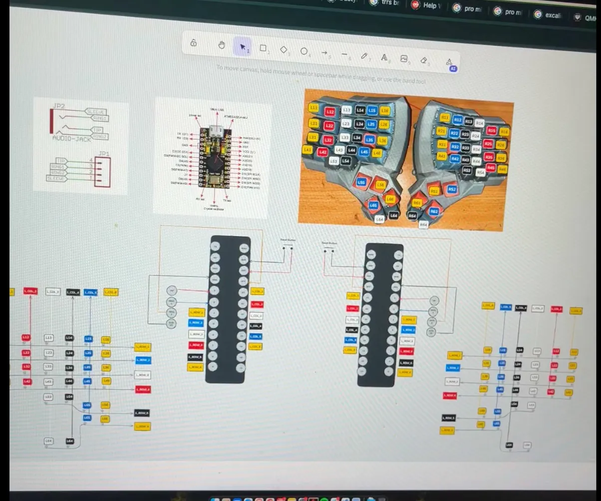
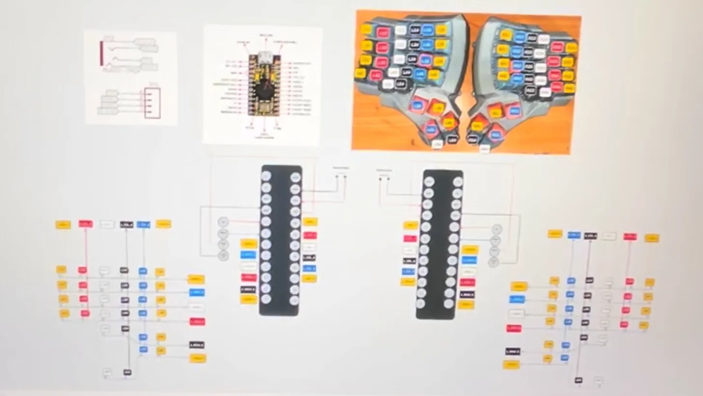

# 🎹 Dactyl Manuform Custom Keyboard

A custom handwired split ergonomic keyboard built from scratch — firmware, wiring, and flashing all done manually.




---

## Specs

| Item | Detail |
| --- | --- |
| Layout | Dactyl Manuform (split ergonomic) |
| MCU | Pro Micro (ATmega32U4) × 2 |
| Firmware | [QMK](https://docs.qmk.fm) |
| Split Connection | TRRS cable |
| Matrix | 6×6 + thumb cluster per side |
| Diode Direction | COL2ROW *(to be confirmed)* |
| Master Side | Right (`MASTER_RIGHT`) |

---

## Project Status

Track progress against the reconstruction plan:

- [ ] **Fase 1** — Reverse keymap dari firmware yang ada (manual key testing)
- [ ] **Fase 2** — Struktur project QMK (folder scaffold)
- [ ] **Fase 3** — File konfigurasi (`config.h`, `info.json`)
- [ ] **Fase 4** — Template keymap (`keymap.c` dengan semua layer)
- [ ] **Fase 5** — Konfirmasi metode master (`MASTER_RIGHT` vs `EE_HANDS`)
- [ ] **Fase 6** — Flashing aman (compile → flash → ulangi sisi lain)
- [ ] **Fase 7** — Debugging matrix (via `qmk console`)

> ⚠️ QMK firmware files saat ini masih **template/placeholder** — pin assignment dan matrix size perlu dikonfirmasi setelah Fase 1 selesai secara fisik.

---

## Repository Structure

```
.
├── docs/
│   ├── reconstruction_plan.md   # Full firmware reconstruction plan (Bahasa Indonesia)
│   ├── build_log.md             # Build journal & progress tracker
│   └── images/
│       ├── dm.webp
│       └── dm2.webp
├── firmware/
│   └── qmk/
│       └── dactyl_manuform_custom/
│           ├── config.h                    # ⚠️ placeholder pins
│           ├── info.json
│           ├── rules.mk
│           ├── dactyl_manuform_custom.h    # LAYOUT macro
│           ├── dactyl_manuform_custom.c
│           └── keymaps/
│               └── default/
│                   ├── keymap.c            # 4 layers
│                   ├── config.h
│                   └── rules.mk
├── .gitignore
├── LICENSE
└── README.md
```

---

## Firmware

The QMK firmware lives in `firmware/qmk/dactyl_manuform_custom/`.

> **Note:** Pin assignments and matrix dimensions are placeholders until physical matrix confirmation (Fase 1) is complete. Files will not compile until confirmed values are filled in.

See [`docs/reconstruction_plan.md`](docs/reconstruction_plan.md) for the full step-by-step plan.

### Quick Build & Flash

```bash
# Setup QMK (once)
pip install qmk
qmk setup

# Copy keyboard to QMK firmware directory
cp -r firmware/qmk/dactyl_manuform_custom \
      ~/qmk_firmware/keyboards/handwired/

# Compile
qmk compile -kb handwired/dactyl_manuform_custom -km default

# Flash (plug in keyboard, press reset button when prompted)
qmk flash -kb handwired/dactyl_manuform_custom -km default
```

---

## Tools Used

| Tool | Purpose |
| --- | --- |
| [Neovim](https://neovim.io) | Primary editor |
| [tmux](https://github.com/tmux/tmux) | Terminal multiplexer |
| [QMK CLI](https://docs.qmk.fm/#/cli) | Firmware build & flash |
| Pro Micro (ATmega32U4) | Microcontroller (×2) |

---

## References

| Resource | Link |
| --- | --- |
| QMK Documentation | https://docs.qmk.fm |
| QMK Split Keyboard | https://docs.qmk.fm/#/feature_split_keyboard |
| Pro Micro Pinout | https://learn.sparkfun.com/tutorials/pro-micro--fio-v3-hookup-guide |
| Dactyl Manuform QMK | https://github.com/qmk/qmk_firmware/tree/master/keyboards/handwired/dactyl_manuform |
| Keyboard Tester | https://www.keyboardtester.com |

---

## License

MIT © 2026 Aris Jirat
